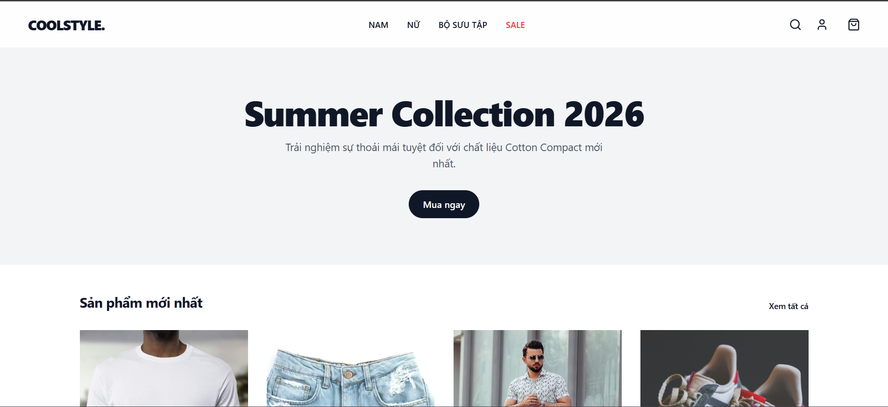

# 👕 CoolStyle - Fashion E-commerce Full Stack

[](https://dotnet.microsoft.com/download/dotnet/8.0)
[](https://vuejs.org/)
[](https://tailwindcss.com/)
[](https://www.docker.com/)
[](https://opensource.org/licenses/MIT)

**CoolStyle** là một nền tảng thương mại điện tử thời trang hiện đại, được xây dựng với kiến trúc **Clean Architecture** ở phía Backend và **Vue 3 Composition API** ở phía Frontend. Dự án được thiết kế để tối ưu khả năng mở rộng, bảo mật và trải nghiệm người dùng cao cấp.

---

## 📸 Giao diện ứng dụng

<div align="center">
  
  <p><i>Giao diện trang chủ với phong cách tối giản và hiện đại</i></p>
</div>

---

## 🚀 Tính năng chính

### 🛒 Người dùng (Storefront)
- **Duyệt Sản phẩm**: Hiển thị danh sách sản phẩm theo dạng lưới (Grid) mượt mà.
- **Giỏ hàng**: Quản lý giỏ hàng (thêm/sửa/xóa) với LocalStorage persistence (không mất dữ liệu khi F5).
- **Thanh toán (Mock)**: Quy trình checkout thu thập thông tin giao hàng và tạo mã đơn hàng.
- **Tài khoản**: Đăng ký và đăng nhập bảo mật với JWT.

### 🛠️ Quản trị (Admin Dashboard)
- **Quản lý đơn hàng**: Xem danh sách toàn bộ đơn hàng của hệ thống.
- **Cập nhật trạng thái**: Chuyển trạng thái đơn hàng (Chờ xử lý, Đã xác nhận, Đang giao, v.v.).
- **Báo cáo**: Theo dõi doanh thu và số lượng đơn (Sắp ra mắt).

---

## 💻 Công nghệ sử dụng

### Backend (.NET API)
- **Framework**: .NET 8 Web API
- **ORM**: Entity Framework Core
- **Database**: SQL Server 2022
- **Security**: ASP.NET Core Identity + JWT Bearer
- **Logging**: Serilog + Seq (Tập trung log)
- **Architecture**: Clean Architecture (Domain, Application, Infrastructure, API)

### Frontend (Vue Web)
- **Framework**: Vue 3 (Script Setup + TS)
- **State Management**: Pinia
- **Styling**: Tailwind CSS v4 (Modern & Fluid UI)
- **Icons**: Lucide-Vue-Next
- **Routing**: Vue Router

### Infrastructure
- **Containerization**: Docker & Docker Compose
- **Network**: Cloudflare Tunnel (HTTPS miễn phí, không cần mở port)
- **Cache**: Redis

---

## 🛠️ Hướng dẫn cài đặt

### 1. Yêu cầu hệ thống
- Docker Desktop
- .NET 8 SDK (Nếu chạy localhost không docker)
- Node.js 20+ (Nếu chạy localhost không docker)

### 2. Triển khai nhanh (Production Mode)
Dự án đã được tự động hóa hoàn toàn bằng script:

```powershell
# Bước 1: Clone dự án
git clone https://github.com/Pain0402/CoolStyle.git
cd CoolStyle

# Bước 2: Tạo file .env và điền thông tin tunnel (Xem docs/CLOUDFLARE_GUIDE.md)
cp .env.example .env

# Bước 3: Deploy
.\deploy.ps1
```

### 3. Chạy môi trường Phát triển (Dev Mode)
Vui lòng tham khảo [WORKFLOW.md](docs/WORKFLOW.md) để biết chi tiết cách chạy từng service rời rạc phục vụ việc viết code.

---

## 📂 Cấu trúc thư mục
```text
CoolStyle/
├── src/
│   ├── Backend/            # ASP.NET Core Web API
│   └── Frontend/           # Vue 3 Vite Application
├── docs/                   # Tài liệu hướng dẫn chi tiết
├── docker-compose.yml      # Cấu hình hạ tầng Dev
├── docker-compose.prod.yml # Cấu hình toàn bộ stack Production
├── deploy.ps1             # Script cài đặt từ đầu
└── update.ps1             # Script cập nhật code mới
```

---

## 📄 License
Phân phối theo giấy phép MIT. Xem `LICENSE` để biết thêm thông tin.

---

## 📞 Liên hệ
**Pain0402** - [GitHub Profile](https://github.com/Pain0402)  
Dự án được tạo ra với mục đích học tập và làm mẫu cho các ứng dụng E-commerce chuyên nghiệp.
