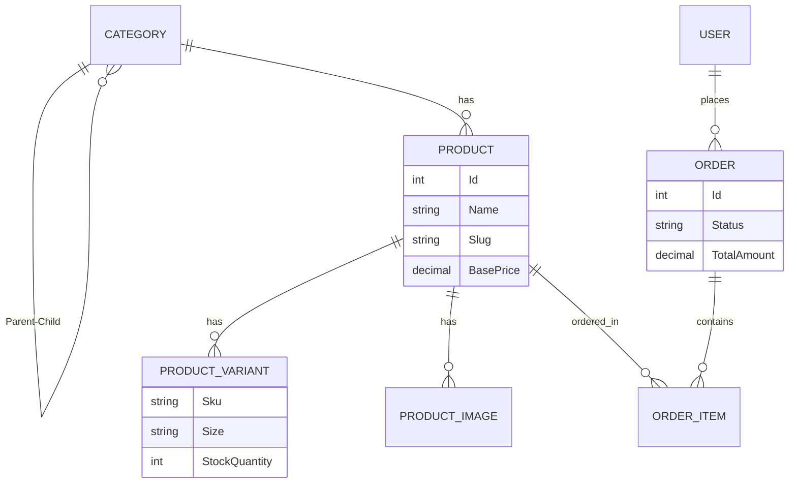

# Database Schema Documentation: CoolStyle Professional 🗄️

Hệ thống sử dụng **SQL Server** làm cơ sở dữ liệu chính, được quản lý thông qua **Entity Framework Core (EF Core)** theo phương pháp Code-First.

## 1. Nguyên tắc chung (Base Principles)

Tất cả các bảng chính (trừ bảng Identity của User) đều kế thừa từ `BaseEntity`, bao gồm các trường chuẩn:
- `Id` (int, Primary Key, Identity): Định danh duy nhất.
- `CreatedAt` (datetime2): Thời điểm tạo bản ghi (mặc định là UTC).
- `UpdatedAt` (datetime2, nullable): Thời điểm cập nhật cuối cùng.
- `IsDeleted` (bit): Hỗ trợ cơ chế Soft Delete (xóa logic).

---

## 2. Chi tiết các bảng (Tables Detail)

### 2.1. Products (Sản phẩm)
Quản lý thông tin chung của sản phẩm.
| Tên trường | Kiểu dữ liệu | Mô tả |
| :--- | :--- | :--- |
| `Name` | nvarchar(max) | Tên sản phẩm |
| `Slug` | nvarchar(450) | URL thân thiện (SEO), Unique Index |
| `Description`| nvarchar(max) | Mô tả chi tiết (HTML/Markdown) |
| `BasePrice` | decimal(18,2) | Giá hiển thị cơ bản |
| `CategoryId` | int (FK) | Liên kết tới bảng Categories |

### 2.2. Categories (Danh mục)
Hỗ trợ cấu trúc cây (Parent-Child) vô hạn cấp.
| Tên trường | Kiểu dữ liệu | Mô tả |
| :--- | :--- | :--- |
| `Name` | nvarchar(max) | Tên danh mục (Nam, Nữ, Áo Thun...) |
| `Slug` | nvarchar(max) | SEO URL |
| `IsFeatured` | bit | Có hiển thị nổi bật ở trang chủ không |
| `ParentId` | int (FK, null) | ID danh mục cha (Id tự tham chiếu) |

### 2.3. ProductVariants (Biến thể sản phẩm)
Quản lý các phiên bản cụ thể theo Size/Màu.
| Tên trường | Kiểu dữ liệu | Mô tả |
| :--- | :--- | :--- |
| `ProductId` | int (FK) | Thuộc sản phẩm nào |
| `ColorName` | nvarchar(max) | Tên màu (vd: Midnight Blue) |
| `ColorHex` | nvarchar(max) | Mã màu CSS (vd: #123456) |
| `Size` | nvarchar(max) | Kích cỡ (vd: XL, M, 30...) |
| `Sku` | nvarchar(450) | Mã kho hàng, Unique Index |
| `PriceModifier`| decimal(18,2)| Giá cộng thêm (nếu có) so với BasePrice |
| `StockQuantity`| int | Số lượng tồn kho hiện tại |

### 2.4. ProductImages (Hình ảnh)
| Tên trường | Kiểu dữ liệu | Mô tả |
| :--- | :--- | :--- |
| `ProductId` | int (FK) | Thuộc sản phẩm nào |
| `Url` | nvarchar(max) | Đường dẫn ảnh (Cloudinary/Unsplash) |
| `IsPrimary` | bit | Ảnh đại diện chính |
| `DisplayOrder` | int | Thứ tự hiển thị |

### 2.5. Orders (Đơn hàng)
| Tên trường | Kiểu dữ liệu | Mô tả |
| :--- | :--- | :--- |
| `UserId` | nvarchar(450) (FK)| ID người dùng (null nếu khách vãng lai) |
| `CustomerName` | nvarchar(max) | Tên người nhận |
| `CustomerEmail`| nvarchar(max) | Email liên hệ |
| `CustomerPhone`| nvarchar(max) | Số điện thoại nhận hàng |
| `ShippingAddress`| nvarchar(max) | Địa chỉ giao hàng chi tiết |
| `TotalAmount` | decimal(18,2) | Tổng giá trị đơn hàng |
| `Status` | int (Enum) | Trạng thái (Pending, Shipped, Delivered...) |

### 2.6. OrderItems (Chi tiết đơn hàng)
Lưu Snapshot thông tin sản phẩm tại thời điểm mua để tránh thay đổi giá/tên trong tương lai ảnh hưởng tới lịch sử.
| Tên trường | Kiểu dữ liệu | Mô tả |
| :--- | :--- | :--- |
| `OrderId` | int (FK) | Thuộc đơn hàng nào |
| `ProductId` | int (FK) | Sản phẩm nào |
| `ProductName` | nvarchar(max) | Tên SP tại thời điểm mua |
| `ProductSku` | nvarchar(max) | SKU tại thời điểm mua |
| `Quantity` | int | Số lượng mua |
| `UnitPrice` | decimal(18,2) | Giá bán tại thời điểm mua |

### 2.7. AspNetUsers (Người dùng)
Mở rộng từ ASP.NET Core Identity.
| Tên trường | Kiểu dữ liệu | Mô tả |
| :--- | :--- | :--- |
| `FullName` | nvarchar(max) | Họ tên đầy đủ |
| Các trường mặc định | ... | Email, PasswordHash, Phone, vv. |

---

## 3. Sơ đồ Quan hệ (Entity Relationships)

---

## 4. Ghi chú Kỹ thuật (Technical Notes)

- **Precision**: Các trường tiền tệ (`decimal`) được cấu hình chính xác `(18, 2)` trong `ApplicationDbContext`.
- **Indexing**: `Slug` (Product) và `Sku` (Variant) được đánh Index Unique để tối ưu tốc độ tìm kiếm và đảm bảo tính duy nhất.
- **Identity**: Sử dụng thư viện Identity mặc định để quản lý Auth, Token và Phân quyền (Roles).
